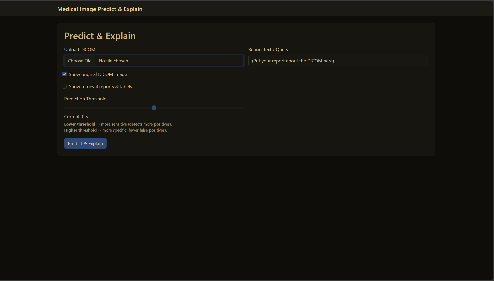
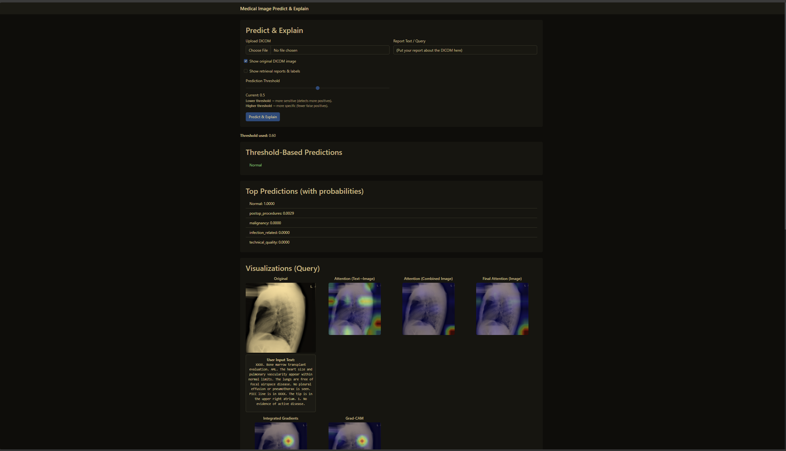
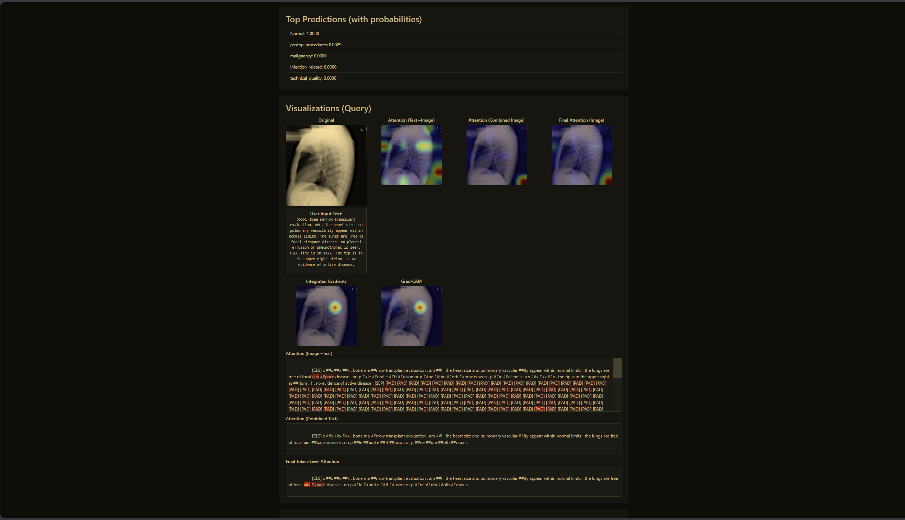
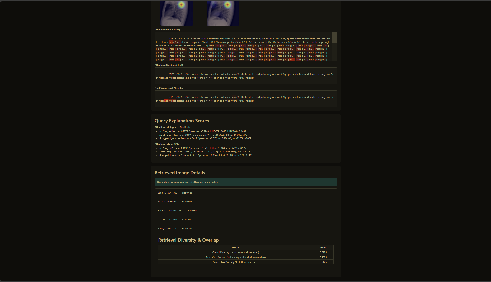
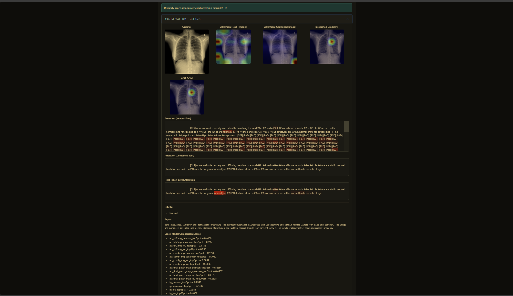
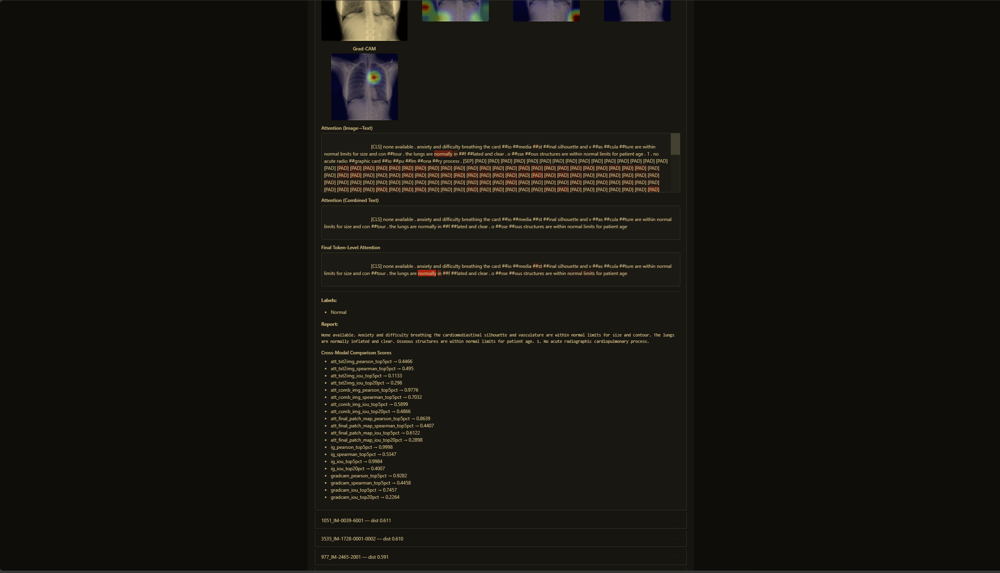

# Multimodal Medical Image Retrieval & Explanation

This is a HCMUS final project which performs **multimodal predict and retrieval** from chest X-rays and radiology reports using deep learning. It supports:

* Disease-aware joint embeddings from image and text (DICOM + report)
* Making prediction
* Retrieval evaluation via relevance ground truth
* Visual explanations (attention + Integrated Gradients)
* Web interface for demo and debugging

---

## Overview

### Features

* DICOM image preprocessing
* Report tokenization using ClinicalBERT
* Cross-modal attention fusion (Swin + BERT)
* Embedding generation for test/query sets
* Retrieval evaluation using shared disease labels
* Attention & IG-based explanation heatmaps
* Flask web interface for demo/explanation

---

## Project Structure

```
project_root/
├── data/               # Raw input (DICOM, XML)
├── embeddings/         # Generated embedding files (.npy, .json)
├── checkpoints/        # Model weights
├── outputs/            # Labeled CSVs
├── ground_truths/      # JSONs with test-to-train relevance
├── splited_data/       # Labeled + split datasets
├── models/             # Swin, BERT, Spacy models
├── src/                # Core Python code (see below)
└── config/             # Training/eval config YAMLs
```

### Notable `src/` files:

* `fusion.py` – CrossModalFusion + Swin/BERT backbone
* `multimodal_retrieval.py` – Core model forward logic
* `dataParser.py` – XML parsing, disease labeling
* `dataLoader.py` – Dataset + DataLoader creation
* `contructGT.py` – Build test-query relevance maps
* `contruct_test_db.py` – Generate embeddings for test queries
* `explanation.py` – Generate IG and attention maps
* `finalOutputData.py` – Apply verified manual labels
* `config.py` – Structured config with auto `run_name`

---

## Getting Started

### 1. Install Dependencies

```bash
pip install -r requirements.txt
```

Also install `en_core_sci_sm` from [SciSpaCy](https://allenai.github.io/scispacy/):

```bash
pip install https://s3-us-west-2.amazonaws.com/ai2-s2-scispacy/releases/v0.5.1/en_core_sci_sm-0.5.1.tar.gz
```

---

### 2. Prepare Data

* Place XML reports under `data/openi/xml/`
* Place DICOMs under `data/openi/dicom/`

(Optional) Run:

```bash
python src/dataEDAnLabeledCheck.py
```

To explore and verify MeSH label coverage.

---

### 3. Label the Reports

```bash
python src/finalOutputData.py
```

This will create `outputs/openi_labels_final.csv`.

---

### 4. Split Dataset

Split and label CSVs should already exist in `splited_data/`. If not, create them manually or using EDA scripts.

---

### 5. Generate Embeddings

Embedding for retrieval can be generate while train `.npy` and `.json` files under `embeddings/` or get from testset when run:

```bash
python src/contruct_test_db.py
```

---

### 6. Build Ground Truth

```bash
python src/contructGT.py
```

Will create `ground_truths/test_relevance.json` and `test_to_train_relevance.json`.

---

### 7. Launch Web Demo

```bash
python web/app.py
```

Then open `http://127.0.0.1:5000` in your browser.

---

## Configuration

Edit YAML under `config/`, which `config/config.yaml` for model setup for example:

```yaml
epochs: 50
batch_size: 4
fusion_type: "cross"
use_hybrid: true
joint_dim: 1024
num_heads: 32
lr: 2e-5
```

This will automatically generate a unique `run_name`.

---

## Dependencies

* PyTorch
* HuggingFace Transformers
* TimM (for Swin Transformer)
* SciSpaCy (`en_core_sci_sm`)
* Flask (for web app)
* Captum (for explanation via IG)
* pydicom, matplotlib, seaborn, pandas, etc.

---

## Evaluation

* Retrieval uses label overlap as relevance.
* Metrics include precision\@k, recall\@k (custom code not shown here).
* Attention and IG maps support explanation of fusion-based predictions.

---

## Example

You can visualize:

* Top retrieved similar cases
* Text-to-image attention heatmaps
* IG/GAMCAM-based disease explanations

### Predict & Explain







### Retrieval Demo

---

## Acknowledgments

* [NIH Open-i Dataset](https://openi.nlm.nih.gov/faq#collection)
* [DOID](http://purl.obolibrary.org/obo/doid.obo)
* [RADLEX](https://bioportal.bioontology.org/ontologies/RADLEX)
* SciSpaCy / ClinicalBERT / Swin Transformer
* Captum (Facebook AI)

## Trained model and embeddings 

Can be found via [HuggingFace link](https://huggingface.co/ppddddpp/multi-modal-retrieval-predict)